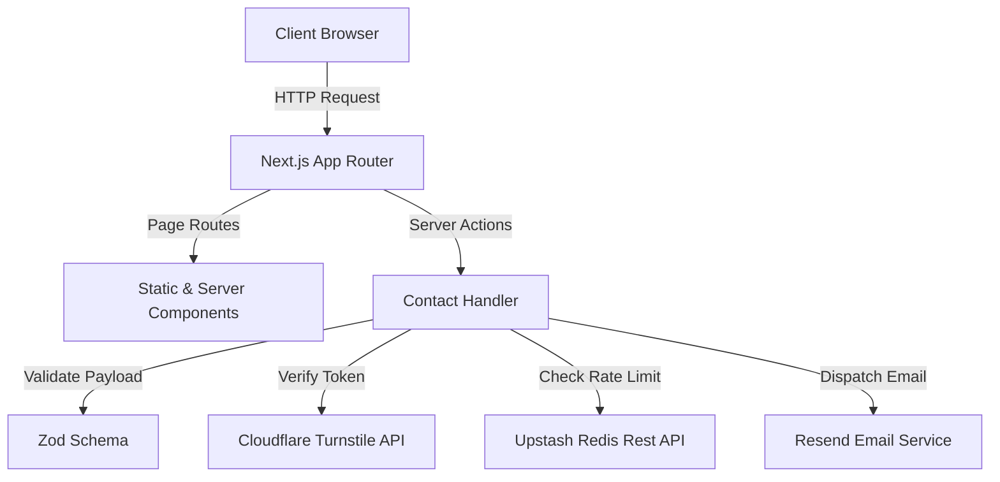

# Meridian Capital

A Next.js 16 real estate transaction advisory and investment intelligence platform. Provides institutional investors with interactive transaction portfolio filtering, performance track record metrics, market insight publications, and secure lead capture.

## Overview

Meridian Capital serves as a digital portal for cross-border real estate transaction advisory. The platform enables prospective institutional clients to explore transaction histories across commercial, residential, and logistics asset classes, analyze performance metrics, review investment intelligence reports, and initiate advisory consultations through a hardened contact workflow.

## Key Features

- **Transaction Directory & Filtering:** Interactive multi-parameter filtering across asset class, deal volume, and geographic region.
- **Performance Track Record Analytics:** Data visualization rendering historical deal flow metrics and regional portfolio distributions.
- **Investment Intelligence Library:** Categorized research publications and market analysis briefings.
- **Secure Lead Capture Server Action:** Contact form backed by Next.js Server Actions with strict Zod validation.
- **Abuse Prevention & Bot Mitigation:** Integrated Cloudflare Turnstile CAPTCHA verification and Upstash Redis rate limiting.
- **Transactional Email Dispatch:** Automated inquiry notification via Resend with fail-safe error handling.

## Architecture



## Technical Stack

- **Framework:** Next.js 16 (App Router, Turbopack)
- **Language:** TypeScript 5.8
- **Styling:** Tailwind CSS 3.4
- **State & Logic:** React 19, Server Actions
- **Validation:** Zod
- **Rate Limiting:** Upstash Redis (`@upstash/ratelimit`, `@upstash/redis`)
- **Security:** Cloudflare Turnstile, Strict CSP headers
- **Email Service:** Resend SDK
- **Testing:** Vitest, Playwright (E2E), Testing Library
- **Sitemap & SEO:** Next-Sitemap

## Project Structure

```
meridian/
├── src/
│   ├── actions/          # Server actions (contact handling, rate limiting)
│   ├── app/              # App router pages (track-record, transactions, insights)
│   ├── components/       # Layout, pattern, and primitive React components
│   ├── config/           # Site metadata and application configuration
│   ├── content/          # Structured static content datasets
│   ├── hooks/            # Custom React hooks (scrolled state, UI helpers)
│   ├── lib/              # Core utilities, email client, metadata generators
│   └── types/            # TypeScript domain type definitions
├── e2e/                  # Playwright end-to-end test specifications
├── public/               # Static assets, sitemaps, and robots.txt
├── vitest.config.ts      # Unit test configuration
└── next.config.ts        # Next.js compiler and security headers setup
```

## Environment Variables

Copy the `.env.example` file to `.env.local` and populate the required API credentials:

```bash
cp .env.example .env.local
```

Required environment variables:

| Variable | Description |
| :--- | :--- |
| `UPSTASH_REDIS_REST_URL` | Upstash Redis REST database URL for rate limiting |
| `UPSTASH_REDIS_REST_TOKEN` | Upstash Redis REST authorization token |
| `RESEND_API_KEY` | Resend API authorization key for transactional email delivery |
| `CONTACT_EMAIL_TO` | Target email address receiving submitted inquiries |
| `CONTACT_EMAIL_FROM` | Sender address verified in Resend |
| `NEXT_PUBLIC_TURNSTILE_SITE_KEY` | Cloudflare Turnstile public site key |
| `TURNSTILE_SECRET_KEY` | Cloudflare Turnstile secret validation key |

## Running Locally

### Prerequisites

- Node.js `>= 20.0.0`
- npm `>= 10.0.0`

### Installation & Execution

1. **Install dependencies:**
   ```bash
   npm install
   ```

2. **Start development server:**
   ```bash
   npm run dev
   ```
   Open `http://localhost:3000` in your browser.

3. **Build for production:**
   ```bash
   npm run build
   npm run start
   ```

## Testing

Run unit and integration tests using Vitest:

```bash
npm test -- --run
```

Run Playwright end-to-end tests:

```bash
npx playwright test
```

## Engineering Highlights

- **Fail-Open Rate Limiting:** The Upstash Redis rate limiter is implemented with fail-open logic, ensuring that temporary network or Redis service disruptions do not block legitimate user inquiries.
- **Client & Server Input Sanitization:** Form inputs undergo double-pass verification via client-side state checks and server-side Zod schema validation.
- **Content Security Policy (CSP):** Next.js headers enforce strict Content Security Policy directives to mitigate cross-site scripting (XSS) and unauthorized resource execution.

## Limitations & Future Improvements

- **Database Persistence:** Inquiry data is currently dispatched via email notification; future versions could integrate PostgreSQL persistence for long-term lead pipeline analytics.
- **CMS Integration:** Research reports and transaction case studies are managed as structured TypeScript datasets; migrating to a headless CMS (e.g., Sanity or Contentful) would enable dynamic editorial workflow management.

## Author

Hamza Riadh Hattab

- **GitHub:** [https://github.com/Hamza-HATTAB](https://github.com/Hamza-HATTAB)
- **LinkedIn:** [https://www.linkedin.com/in/hamza-riadh-h-44a297345/](https://www.linkedin.com/in/hamza-riadh-h-44a297345/)

## License

This project is licensed under the MIT License.
